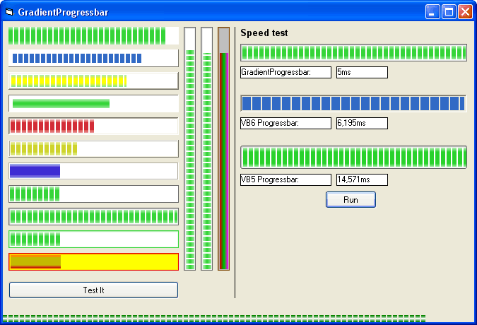



## GradientProgressbar \[20\.08\.05\]

### Description

Very fast ProgressBar with many styles and functions, like Scrollbar, negative values, complete modifiable bar and background. No pictures needed!

[20.08.05] - overflow error solved
 
### More Info
 

             |
---                |---
**Submitted On**   |2005-08-19 21:18:58
**By**             |[Frank Maier](https://github.com/Planet-Source-Code/PSCIndex/blob/master/ByAuthor/frank-maier.md)
**Level**          |Intermediate
**User Rating**    |5.0 (30 globes from 6 users)
**Compatibility**  |VB 5\.0, VB 6\.0
**Category**       |[Custom Controls/ Forms/  Menus](https://github.com/Planet-Source-Code/PSCIndex/blob/master/ByCategory/custom-controls-forms-menus__1-4.md)
**World**          |[Visual Basic](https://github.com/Planet-Source-Code/PSCIndex/blob/master/ByWorld/visual-basic.md)
**Archive File**   |[GradientPr1925638202005\.zip](https://github.com/Planet-Source-Code/frank-maier-gradientprogressbar-20-08-05__1-62242/archive/master.zip)

